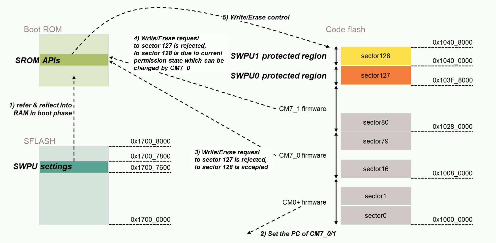
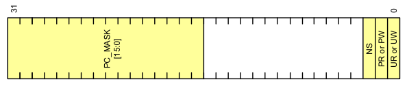
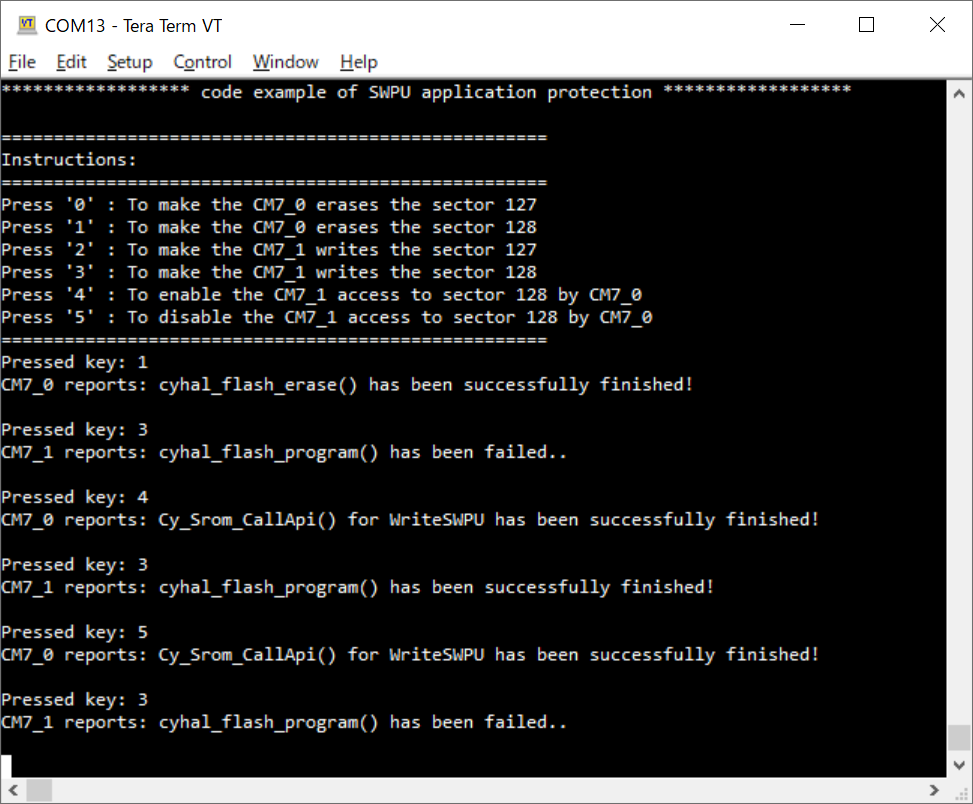

# SECURE SWPU App Protection

**This code example shows how to configure user application protection using a SWPU (SoftWare Protection Unit).**  

## Device

The device used in this code example (CE) is:

- [TRAVEO™ T2G CYT4BF Series](https://www.infineon.com/cms/en/product/microcontroller/32-bit-traveo-t2g-arm-cortex-microcontroller/32-bit-traveo-t2g-arm-cortex-for-body/traveo-t2g-cyt4bf-series/)

## Board

The board used for testing is:

- TRAVEO™ T2G evaluation kit (`KIT_T2G-B-H_EVK`, `KIT_T2G-B-H_LITE`)

## Scope of work

The SWPU of the TRAVEO™ T2G MCU consists of the FWPU (Flash Write Protection Unit), ERPU (eFuse Read Protection Unit), and EWPU (eFuse Write Protection Unit) to protect the protection target from access by the user application. This CE configures the FWPU to protect the write/erase access to the Code Flash from each CM7 cores.

## Introduction  

**Protection Unit**  
The Protection Unit of TRAVEO™ T2G MCU supports the following features:

- An address range that is accessed by the transfer
    - Subregion: An address range is partitioned into eight equally-sized subregions and subregion can individual disables
- Access attributes such as:
    - Read/write attribute
    - Execute attribute to distinguish a code access from a data access
    - User/privilege attribute to distinguish access; for example, OS/kernel access from a task/thread access
    - Secure/non-secure attribute to distinguish a secure access from a non-secure access; the Arm Cortex-M CPUs do not natively support this attribute
    - A protection context attribute to distinguish accesses from different protection contexts; for Peripheral-DMA (P-DMA) and Memory-DMA (M-DMA), this attribute is extended with a channel identifier, to distinguish accesses from different channels
- Memory protection
- Provided by memory protection units (MPUs) and shared memory protection units (SMPUs)
    - MPUs distinguish user and privileged accesses from a single bus master
    - SMPUs distinguish between different protection contexts and between secure and non-secure accesses
- Peripheral protection
    - Provided by peripheral protection units (PPUs)
    - The PPUs distinguish between different protection contexts; they also distinguish secure from non-secure accesses and user mode accesses from privileged mode accesses
- Protection pair structure
- Software Protection Unit (SWPU): SWPUs define flash write (or erase) permissions, and eFuse read and write permissions. An SWPU comprises of the following:
    - Flash Write Protection Unit (FWPU)
    - eFuse Read Protection Unit (ERPU)
    - eFuse Write Protection Unit (EWPU)

More details can be found in [Technical Reference Manual (TRM)](https://www.cypress.com/documentation/technical-reference-manuals/traveo-ii-automotive-body-controller-high-family), [Registers TRM](https://www.cypress.com/documentation/technical-reference-manuals/traveo-t2g-tvii-b-h-8m-registers-body-controller-high) and [Data Sheet](https://www.cypress.com/documentation/datasheets/cyt4bf-datasheet-32-bit-arm-cortex-m7-microcontroller-traveo-ii-family).

## Hardware setup

This CE has been developed for:

- TRAVEO™ T2G evaluation kit (`KIT_T2G-B-H_EVK`) 
 
No changes are required from the board's default settings.

## Implementation

In this CE, the FWPU is configured to protect 2 regions of the Code Flash. The one is for protect sector127 (address: 0x103F8000, size: 0x8000) from write/erase access by both CM7_0/1. The another is for protect sector128 (address: 0x10400000, size: 0x8000) from write/erase access by CM7_1, and this region is set as reconfigurable by CM7_0. 

**Protect Context (PC) setting (CM0+)**  

First, to achieve this CE behavior, CM7_0 and CM7_1 must be set up on different PCs: the PC for CM7_0 is 6 and the PC for CM7_1 is 7. This operation is done by CM0+ by calling [Cy_Prot_ConfigBusMaster()](https://infineon.github.io/mtb-pdl-cat1/pdl_api_reference_manual/html/group__group__prot__functions__busmaster.html#ga4b69f79e24b30f22a706e973b05dd079) and [Cy_Prot_SetActivePC()](https://infineon.github.io/mtb-pdl-cat1/pdl_api_reference_manual/html/group__group__prot__functions__busmaster.html#ga2d3a54039578a9fae98f6c7b4c4cff41) in its initialization phase.

**Supervisory Flash (SFLASH) configuration (CM0+)**  

The FWPU settings which placed in SFLASH is prepared in `main.c` of CM0+, that set the protection as follows:

- `N_FWPU` (2): The number of FWPU objects. FWPU has up to 16 regions.

The FWPU region 0 is set as below:

- `FWPU0_SL` (0x103F8000): Configures the base address of FWPU region 0. This value is the start address of third sector of Code Flash.
- `FWPU0_SIZE` (0x8000): Configures the size of protection area from FWPU0_SL.
- `FWPU0_SL_ATT`: Configures the slave attribute. This element sets the attribute for write access to Flash memory. 
  - `PC_MASK`: Set the bit [6]/[7] as 0 to protect this region from be accessed from both CM7_0/1.
  - `NS`/`PW`/`UW`: Set these bits to 1 (In this CE, the state of secure/non-secure and priviledge/user are not used as decide protection attribute).
- `FWPU0_MS_ATT`: Configures the master attribute. This element sets the attribute to access the `FWPU0_SL_ATT` via calling SROM API `WriteSWPU()`. This value is given the same value with `FWPU0_SL_ATT` to disable access.

The FWPU region 1 is set as below:

- `FWPU1_SL` (0x10400000): The meaning is same as `FWPU0_SL`, but this is for the FWPU region 1.
- `FWPU1_SIZE` (0x8000): The meaning is same as `FWPU0_SIZE`, but this is for the FWPU region 1.
- `FWPU1_SL_ATT`/`FWPU1_MS_ATT`: The meaning is same as `FWPU0_SL_ATT`/`FWPU0_MS_ATT`, but this is for the FWPU region 1. To enable the access from CM7_0, PC_MASK[6] is set to 1.

**Miscellaneous settings**  

- **STDIO setting (CM0+)**
  - Calling [cy_retarget_io_init()](https://infineon.github.io/retarget-io/html/group__group__board__libs.html#ga21265301bf6e9239845227c2aead9293) function to use UART as STDIN/STDOUT
    - Initialize the pin specified by CYBSP_DEBUG_UART_TX as UART TX, the pin specified by CYBSP_DEBUG_UART_RX as UART RX (these pins are connected to KitProg3 COM port)
    - The serial port parameters become to 8N1 and 115200 baud
  - The UART receiving interrupt is configured in the [cyhal_uart_enable_event()](https://infineon.github.io/mtb-hal-cat1/html/group__group__hal__uart.html#ga4dae4cef7dbf1d7935fe6dd6d31f282e) function
  - The interrupt service routine (ISR) is registered by the [cyhal_uart_register_callback()](https://infineon.github.io/mtb-hal-cat1/html/group__group__hal__uart.html#gae26bab64811713b1d69170352fe32c20) function

- **Code Flash initialization (CM0+)**
  - Calling [cyhal_flash_init()](https://infineon.github.io/mtb-hal-cat1/html/group__group__hal__flash.html#ga669e3789204d0cf9610a85f26a28c55b) function and `Cy_Flashc_MainWriteEnable()` function to initialize Code Flash to be able to write/erase from CM7_0/1

- **Enabling CM7_0/1 (CM0+)**
  - The CM7_0/1 core will be enabled by calling `Cy_SysEnableCM7()` function with their top address where the vector table exists

**Confirming protection effects**  

- When the CM0+ received the command through the terminal, interrupt occur and the received character can be read by calling [cyhal_uart_read_async()](https://infineon.github.io/mtb-hal-cat1/html/group__group__hal__uart.html#ga00ef108f7ee7beba3d5090b2e506b54f), then it reflects to instructions for the CM7_0/1 by `processKeyPress()`
- The instructions and responses are delivered via SRAM which are commonly used between 3 cores
- The CM7_0/1 performs flash erase or write access by calling [cyhal_flash_erase()](https://infineon.github.io/mtb-hal-cat1/html/group__group__hal__flash.html#ga10b68f24a5c9a7c929a2c1fa3af89858) or [cyhal_flash_program()](https://infineon.github.io/mtb-hal-cat1/html/group__group__hal__flash.html#ga66a23d2dfbe01d027f8e9318999b7e19) when they detects the instruction. These will be rejected or granted according to the current FWPU settings.
- Also they performs changing the FWPU protection settings by calling `Cy_Srom_CallApi()`. This actually implements the `ReadFWPU()` and `WriteFWPU()` SROM APIs described in the [TRM](https://www.cypress.com/documentation/technical-reference-manuals/traveo-ii-automotive-body-controller-high-family). These accesses are also controlled according to the current FWPU settings.

## Run and Test

For this CE, a terminal emulator is required for displaying outputs and get inputs. Install a terminal emulator if you do not have one. Instructions in this document use [Tera Term](https://ttssh2.osdn.jp/index.html.en).

After code compilation and the digital signature addition, perform the following steps to flashing the device:

1. Connect the board to your PC using the provided USB cable through the KitProg3 USB connector.
2. Open a terminal program and select the KitProg3 COM port. Set the serial port parameters to 8N1 and 115200 baud.
3. Program the board by the following steps:
    - Select the CE project in the Project Explorer.
    - In the **Run** menu, select **Run Configurations..** to show **Run Configurations** window. Then select **[Project Name] Program (KitProg3_MiniProg4)** and select **Debugger** tab. Then change the string `cat1c sflash_restrictions 1` displayed in **Config options:** textbox to `cat1c sflash_restrictions 3`. Note that if you use another configuration, it should be samely changed.
    - In the **Quick Panel**, scroll down, and click **[Project Name] Program (KitProg3_MiniProg4)**.
4. After programming, the CE starts automatically. Confirm that the messages are displayed on the UART terminal. 

5. You can debug the example to step through the code. In the IDE, use the **[Project Name] Debug (KitProg3_MiniProg4)** configuration in the **Quick Panel**. For details, see the "Program and debug" section in the [Eclipse IDE for ModusToolbox™ software user guide](https://www.cypress.com/MTBEclipseIDEUserGuide).

**Note:** **(Only while debugging)** On the CM7 CPU, some code in `main()` may execute before the debugger halts at the beginning of `main()`. This means that some code executes twice ? once before the debugger stops execution, and again after the debugger resets the program counter to the beginning of `main()`. See [KBA231071](https://community.cypress.com/docs/DOC-21143) to learn about this and for the workaround.

## References  

Relevant Application notes are:

- AN235305 - GETTING STARTED WITH TRAVEO™ T2G FAMILY MCUS IN MODUSTOOLBOX™
- [AN228680](https://www.infineon.com/dgdl/Infineon-AN228680_Secure_System_Configuration_in_TRAVEO_T2G_Family-ApplicationNotes-v04_00-EN.pdf?fileId=8ac78c8c7cdc391c017d0d3e888b67e2) - Secure system configuration in TRAVEO™ T2G family

ModusToolbox™ is available online:
- <https://www.infineon.com/modustoolbox>

Associated TRAVEO™ T2G MCUs can be found on:
- <https://www.infineon.com/cms/en/product/microcontroller/32-bit-traveo-t2g-arm-cortex-microcontroller/>

More code examples can be found on the GIT repository:
- [TRAVEO™ T2G Code examples](https://github.com/orgs/Infineon/repositories?q=mtb-t2g-&type=all&language=&sort=)

For additional trainings, visit our webpage:  
- [TRAVEO™ T2G trainings](https://www.infineon.com/cms/en/product/microcontroller/32-bit-traveo-t2g-arm-cortex-microcontroller/32-bit-traveo-t2g-arm-cortex-for-body/traveo-t2g-cyt4bf-series/#!trainings)

For questions and support, use the TRAVEO™ T2G Forum:  
- <https://community.infineon.com/t5/TRAVEO-T2G/bd-p/TraveoII>  
